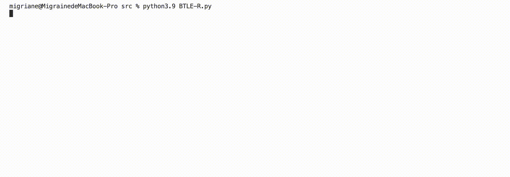
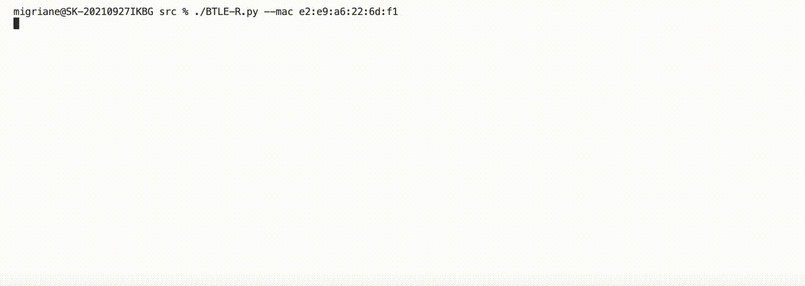
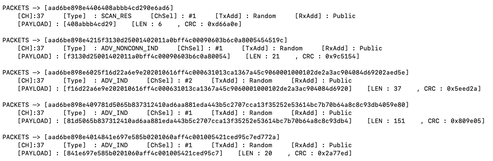
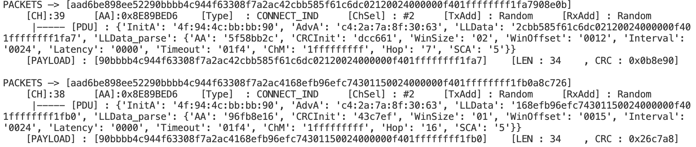
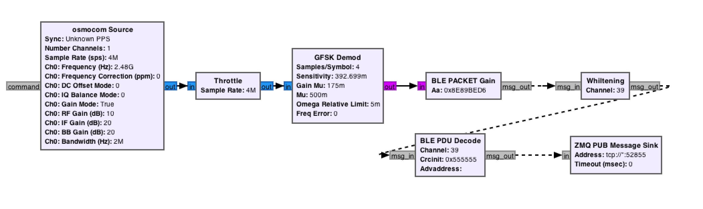
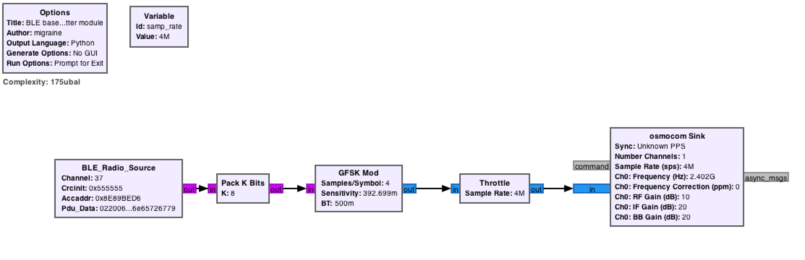

# BTLE-R

[](https://www.oscs1024.com/project/migraine-sudo/BTLE-R?ref=badge_small)

**BTLE-Radio** is an open source software-defined radio (HackRF One) Bluetooth low energy software experiment kit. Implement BLE baseband using software definition. In the BLE protocol stack, it corresponds to the physical layer and the link layer.

Currently supports sniffing and parsing of air interface packets in three frequency bands, so stay tuned!

> Refer to Bluetooth Core Specification v 5.3

# Requirements

Tested runtime environment  *(but not required)* :

- [gnuradio](https://github.com/gnuradio/gnuradio) v*3.8.5.0*
- [gr-osmosdr](https://github.com/osmocom/gr-osmosdr) v*0.2.0.0*
- [HackRF One](https://github.com/greatscottgadgets/hackrf) with firmware 2021.03.1

# BUILD&RUN

Install the HackRF driver and GNURadio components, and the default firmware of HACKRF ONE can be used.

## OSX

There are many OSX installation problems, it is recommended to upgrade macport to the latest version. My test environment is OSX12.4.

Install hackrf driver

```shell
sudo port install hackrf
```

The GNURadio suite can be installed using the command, but it is recommended to download and install the [DMG version](https://github.com/ktemkin/gnuradio-for-mac-without-macports/releases).

```shell
sudo port install gnuradio
```

To use HackRF One on OSX platform, additionally install gr-osmosdr for GNURadio

```shell
sudo port install gr-osmosdr
```

## Ubuntu

Compile the hackrf driver

```shell
cd ~/hackrf_files && git clone https://github.com/mossmann/hackrf.git
cd ~/hackrf_files/hackrf/host && mkdir build && cd build && cmake .. && make && sudo make install && sudo ldconfig
```

Install GNURadio Suite

```shell
 sudo aptitude install gnuradio
```

run gnuradio companion

```shell
sudo gnuradio-companion
```

## RUN

Run BTLE-R (in development). Use python to customize the baseband logic, and currently can complete the frequency hopping of the broadcast channel.

**USAGE**

```
usage: BTLE-R.py [-h] [-v] [-m MAC] [-c CH] [-t FILE]

Command Line Interface for BTLE-Radio Bluetooth Baseband Experiment Kit

optional arguments:
  -h, --help                Show this help message and exit
  -v, --version             Show version and exit
  -m MAC, --mac MAC         Filter packets by advertiser MAC
  -c CH, --channel CH       Monitor the broadcast channel CHA, the range is 0-39, the default is 37-39
  -t FILE, --transfer FILE  Send link layer data, data from JSON file [ Example in src/transfer/packets.txt ]
```

**Example**

Monitor the content of all broadcast channels

```
 $ ./BTLE-R.py
```



Monitor the content of a broadcast channel of a mac address

```shell
 $ ./BTLE-R.py --mac e4:00:20:44:7c:d4
```



Send BLE link layer packets, on any channel，Content format see [packets.txt](src/transfer/packets.txt).

```shell
$ ./BTLE-R.py -t transfer/packets.txt
```


**[Warning]**

My test environment is MacOSX. If an error occurs when running (especially when switching to Ubuntu), please use GNURadio Companion to rebuild the code, and then use BTLE-R.py again.

**[For Debug and Dev]**

Run GRC. The flow chart is mainly used to develop and debug BTLE-R. You can manually set the frequency band, AccessAddress, etc. in the parameters. If you need to perform automatic channel selection and connection tracking, please use BTLE-R directly.

To run the flow graph in GNURadioCompanion or run the python script ble_decode.py, use the following command.

```shell
$ python3 ble_decode.py
```

A BLE sending interface is provided. Use the following commands to debug this interface for secondary development.

```shell
$ python3 trans_interface.py packets.txt
```

## SNIFF

BTLE Air Interface Capture

1. Advertising physical channel packets Capture

   - Advertising/Scanning PDUs Capture

   

   - Initiating PDUs Capture

     e.g. CONNECT_IND packet capture，parsing the packet can be used to obtain key information of the link connection, including frequency hopping algorithm (and ChannelMap), CRC initial data and Connect Interval, etc.

     

# Doc

**Sniffer Moudle Design**



- GFSKDemod (GNURadio Default)
- BlE Packets Gain
- Data Whiting/De-Whiting
- CRC Check
- PDU Parse(Only Advertising Physical Channel，so far)
- Hop channel

**Transfer Moudle Design**



- BLE_Radio_Source（Requires PDU, transmit channel, Access Address, CRCinit and other information）
  - LL_Data Package 
  - CRC calculation
  - Data Whitening
  - Hop channel

In the Plan

- Data Physical Channel
- Channel Selection
