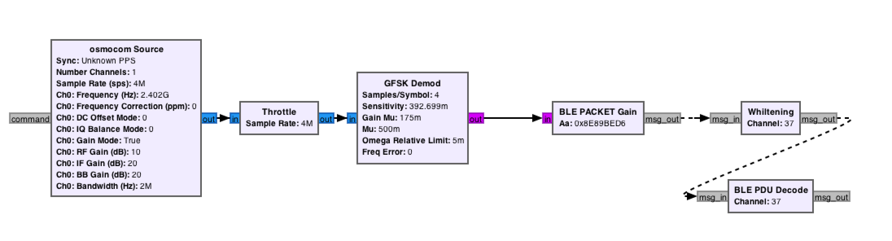

# BTLE-R


BTLE-R is a sniffing module for an open source software-defined radio (HackRF One) Bluetooth Low Energy software experiment kit.
Currently under development, it supports sniffing and parsing of broadcast packets.Please look forward to!

# Requirements

Tested runtime environment  *(but not required)* :

- [gnuradio](https://github.com/gnuradio/gnuradio) v*3.8.5.0*

- [gr-osmosdr](https://github.com/osmocom/gr-osmosdr) v*0.2.0.0*

- [HackRF One](https://github.com/greatscottgadgets/hackrf) with firmware 2021.03.1

# BUID&RUN

Install the HackRF driver and GNURadio components, and the default firmware of HACKRF ONE can be used.

## OSX

There are many OSX installation problems, it is recommended to upgrade macport to the latest version. My test environment is OSX12.4.

Install hackrf driver

```shell
sudo port install hackrf
```

The GNURadio suite can be installed using the command, but it is recommended to download and install the [DMG version](https://github.com/ktemkin/gnuradio-for-mac-without-macports/releases).

```shell
sudo port install gnuradio
```

To use HackRF One on OSX platform, additionally install gr-osmosdr for GNURadio

```shell
sudo port install gr-osmosdr
```

## Ubuntu

Compile the hackrf driver

```shell
cd ~/hackrf_files && git clone https://github.com/mossmann/hackrf.git
cd ~/hackrf_files/hackrf/host && mkdir build && cd build && cmake .. && make && sudo make install && sudo ldconfig
```

Install GNURadio Suite

```shell
 sudo aptitude install gnuradio
```

run gnuradio companion

```shell
sudo gnuradio-companion
```

## RUN

To run the flow graph in GNURadioCompanion or run the python script ble_decode.py, use the following command.

```shell
$ python3 ble_decode.py
```


# Doc



Moudle Design
